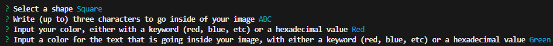
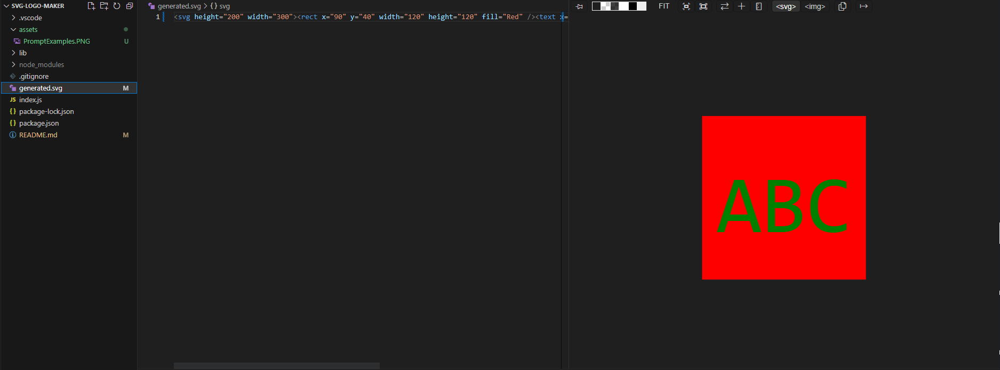

# SVG-Logo-Maker

## Description
A command-line application that generates a simple logo based on user input. 

This project was built to test command-line capabilites, as well as tying in various Node.Js
packages such as Inquirer and Jest. In addition, I've experimented with Class construction, inheritence, and polymorphism to attempt to build this application.

## Installation
[Node.Js](https://nodejs.org/en), [Inquirer](https://www.npmjs.com/package/inquirer) at version 8.2.4, and [Jest](https://jestjs.io/) are all needed to run this application. If Node is already installed, you can run the following code:

```
npm init
npm install inquirer@8.2.4
npm install jest
```
to install the packages required to run this application.


If you are intending on utilizing the various tests in the shapes.test.js file be sure to include the following code in your package.json file:

```
"scripts": {"test": "jest"}
```


Feel free to copy/paste this code into your own application and run it using a command-line terminal such as Git Bash, or a built-in powershell/bash terminal in your coding application.

To activate the function once installed, use
```
node index.js
```
if you've renamed the original index.js file, be sure to reflect that in the node command.

## Usage
Running the 
```
node index.js
```
command will prompt you to answer several questions in the command line. The questions you'll answer are shown in the following image:


After successfully running, a new file called "generated.svg" will be created, and an SVG image will generate based on the user input from the previous prompts.



This application is useful for quickly generating an SVG image based on user input. A video walkthrough of this program can be seen [here](https://youtu.be/aKitLrSrJVE)


## Credits 
- Jude Clark, a tutor found through Washington University's Fullstack Developer Bootcamp, has collaborated with me on this project.

## License
Please refer to the GitHub repository for licensing information.
